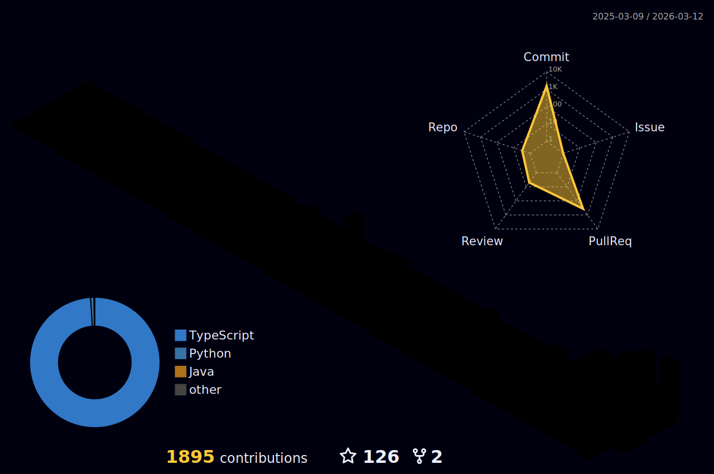

### Hi there 👋 I'm Thomas
<p align="center">
  
 <a href="https://git.io/typing-svg"></a>
</p>

[](https://github.com/ryo-ma/github-profile-trophy)

### I believe a person's chosen tech stack is a window into their soul. Here's mine:

### 💻 Languages:


### 🏎️ Development:


### 🤖 ML/DL


### 🚀 Ops


<div align="center">
    <a href="https://git.io/streak-stats">
        
    </a>
</div>

```java
public class Thomas //import coffee library if undefined
{
  private int age = 20;
  private int showersTaken = 12301; // Minutes, not Seconds
  private int timesILaughedAtMyOwnJokes = 5000; // Conservatively
  private HashMap<String, String> traits;

  protected String[] secret_skills = {
    "Making pets love me instantly",
    "Winning at rock-paper-scissors",
    "Sleep-typing perfect code",
    "Mastering the art of being 'fashionably late'",
    "Fluent in three languages: English, Sarcasm, and Movie References.",
    "A walking, talking encyclopedia of useless trivia.",
    "Possesses the uncanny ability to choose the slowest moving line every time."
  };
  public String[] talents = new String[] { "Freestyling", "Soccer", "Swimming", "Taekwondo", "Lifting", "Trivia", "Sleeping", "Coding :)" };

  public UserProfile() {
        traits = new HashMap<>();
        traits.put("MemeExpertise", "Internet Meme Connoisseur");
        traits.put("KnowledgeSeeker", "Avid seeker of knowledge, from quantum physics to the perfect Tandoori Chicken Recipe.");
        traits.put("Fashionista", "Sartorial experimentalist, boldly mixing patterns since childhood.");
        traits.put("Expertise", "Nerd");
        traits.put("Redditor", "Wallstreetbetter");
    }
}
```


<!--
**ThomasOli/ThomasOli** is a ✨ _special_ ✨ repository because its `README.md` (this file) appears on your GitHub profile.

Here are some ideas to get you started:

- 🔭 I’m currently working on ...
- 🌱 I’m currently learning ...
- 👯 I’m looking to collaborate on ...
- 🤔 I’m looking for help with ...
- 💬 Ask me about ...
- 📫 How to reach me: ...
- 😄 Pronouns: ...
- ⚡ Fun fact: ...
-->
