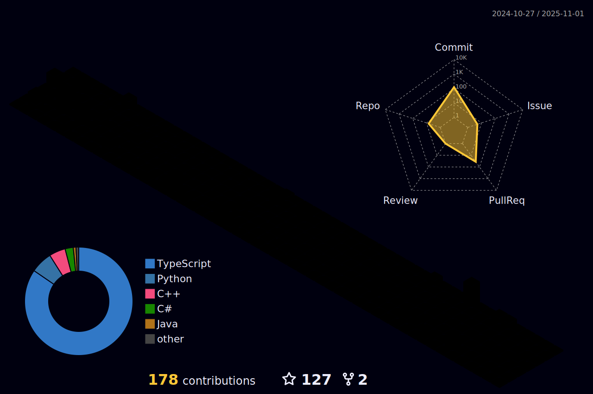

### Hi there 👋 I'm Thomas
<p align="center">
  
 <a href="https://git.io/typing-svg"></a>
</p>

```java
public class Thomas
{
  private int age = 19;
  private int coffeeConsumed = 9872; // Gallons, not cups
  private int showersTaken = 12301; // Minutes, not Seconds
  private int timesILaughedAtMyOwnJokes = 5000; // Conservatively

  "traits": [
        "Internet Meme Connoisseur",
        "Shorter than a tree but taller than a grasshopper",
        "Nerd, but in a cool wizard way"
    ],

   "secret_skills": [
        "Teleporting to fridge at 3am",
        "Making pets love me instantly",
        "Winning at rock-paper-scissors",
        "Eating faster than light",
        "Sleep-typing perfect code",
        "Dodging spoilers like a ninja",
        "Speaking fluent movie quotes",
        "Mastering the art of being 'fashionably late'"
    ]

  public String[] talents = new String[] { "Freestyling", "Soccer", "Swimming", "Taekwondo", "Lifting", "Trivia", "Sleeping" };
}
```
#### 📍 What Am I Doing?

- 🔭 I’m currently working on Full-Stack Development
- 🌱 I’m currently learning React Native & React
- 👯 I’m looking to collaborate on unique user-based web applications and innovative ideas
<div align="center">
       
</div>


### I believe a person's chosen tech stack is a window into their soul. Here's mine:
  
<p align="center">
<a href="https://learn.microsoft.com/en-us/cpp/c-language/?view=msvc-170" target="_blank" rel="noreferrer"></a>
<a href="https://docs.microsoft.com/en-us/cpp/?view=msvc-170" target="_blank" rel="noreferrer"></a>
<a href="https://learn.microsoft.com/en-us/dotnet/csharp/" target="_blank" rel="noreferrer"></a>
<a href="https://www.python.org/" target="_blank" rel="noreferrer"></a>
<a href="https://www.mysql.com/" target="_blank" rel="noreferrer"></a>
<a href="https://flutter.dev/" target="_blank" rel="noreferrer"></a>
<a href="https://www.react.dev/" target="_blank" rel="noreferrer"></a>
<a href="https://reactnative.dev/" target="_blank" rel="noreferrer"> 
<a href="https://www.w3.org/html/" target="_blank" rel="noreferrer">  </a>
<a href="https://www.mongodb.com/" target="_blank" rel="noreferrer">  </a>
<a href="https://postman.com" target="_blank" rel="noreferrer">  </a>
<a href="https://supabase.com/" target="_blank" rel="noreferrer"></a> 
<a href="https://nodejs.org/en" target="_blank" rel="noreferrer"></a> 
<a href="https://www.figma.com/" target="_blank" rel="noreferrer"></a>
<a href="https://www.adobe.com/uk/products/photoshop.html" target="_blank" rel="noreferrer"></a>
</p>
               
<div align="center">
    
    <a href="https://git.io/streak-stats">
        
    </a>
</div>



<!--
**ThomasOli/ThomasOli** is a ✨ _special_ ✨ repository because its `README.md` (this file) appears on your GitHub profile.

Here are some ideas to get you started:

- 🔭 I’m currently working on ...
- 🌱 I’m currently learning ...
- 👯 I’m looking to collaborate on ...
- 🤔 I’m looking for help with ...
- 💬 Ask me about ...
- 📫 How to reach me: ...
- 😄 Pronouns: ...
- ⚡ Fun fact: ...
-->
